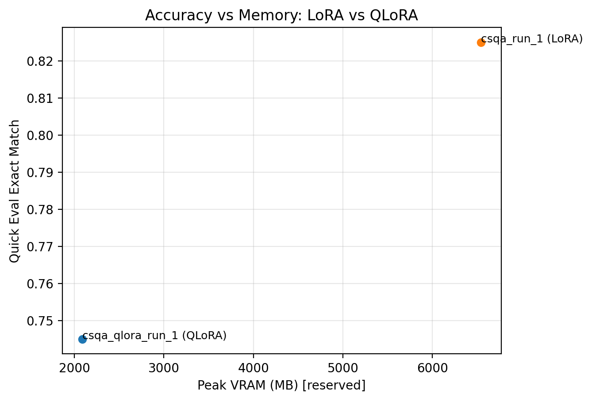

# ReasonTune 🔍  
**Reasoning-Style Fine-Tuning with LoRA vs QLoRA**

This project explores **parameter-efficient fine-tuning (PEFT)** for large language models by comparing **LoRA** and **QLoRA** on a reasoning task (**CommonsenseQA**).  
The goal is to study the **accuracy vs memory trade-off** when adapting instruction-tuned LLMs under different GPU constraints.

---

## 🚀 Project Highlights

- Fine-tuned **Qwen/Qwen2.5-1.5B-Instruct**
- Compared **LoRA (FP16)** vs **QLoRA (4-bit NF4)**
- Evaluated reasoning performance using **Exact Match**
- Tracked **peak GPU memory usage**
- Designed to be **Windows + single-GPU friendly**

---

## 🧠 What This Project Demonstrates

- How **LoRA** injects low-rank adapters into attention layers  
- How **QLoRA** enables training under tight VRAM budgets via 4-bit quantization  
- Practical challenges of mixed precision and AMP on Windows  
- Trade-offs between **model quality** and **hardware efficiency**

This is a **real-world PEFT comparison**, not a toy experiment.

---

## 📊 Results (Quick Eval, n = 200)

**Dataset:** `tau/commonsense_qa`  
**Train samples:** 8,000  
**Sequence length:** 1024  

| Method | Base Precision | Exact Match | Peak VRAM (Reserved) | Train Time |
|------|----------------|-------------|----------------------|------------|
| **LoRA** | FP16 | **0.825** | **6546 MB** | 1498 s |
| **QLoRA** | INT4 (NF4) + FP16 compute | 0.745 | **2086 MB** | 2106 s |

### Key Takeaways

- **QLoRA reduced peak VRAM usage by ~68%**
- This came with an **~8 point drop in accuracy**
- **LoRA** is preferable when accuracy matters
- **QLoRA** is ideal when GPU memory is the bottleneck



---

## 🏗️ Project Structure

```text
ReasonTune/
├── configs/
│   ├── train_csqa.yaml
│   ├── train_csqa_qlora.yaml
│   └── eval.yaml
├── src/
│   ├── train_lora.py
│   ├── eval.py
│   ├── infer.py
│   ├── plot_accuracy_vs_memory.py
│   ├── data.py
│   ├── metrics.py
│   └── utils.py
├── outputs/
│   ├── csqa_run_1/
│   ├── csqa_qlora_run_1/
│   └── accuracy_vs_memory.png
├── requirements.txt
└── README.md
```

---

## ⚙️ Setup Instructions

### 1️⃣ Create and activate a virtual environment
```bash
python -m venv .venv
.venv\Scripts\activate
```

### 2️⃣ Install dependencies
```bash
pip install -r requirements.txt
```

> **Note:** CUDA-enabled PyTorch is required for GPU training.

---

## 🏋️ Training

### 🔹 LoRA (FP16)
```bash
cp configs/train_csqa.yaml configs/train.yaml
python -m src.train_lora
```

### 🔹 QLoRA (4-bit)
```bash
cp configs/train_csqa_qlora.yaml configs/train.yaml
python -m src.train_lora
```

---

**Built as a hands-on PEFT study for real-world LLM fine-tuning.**
